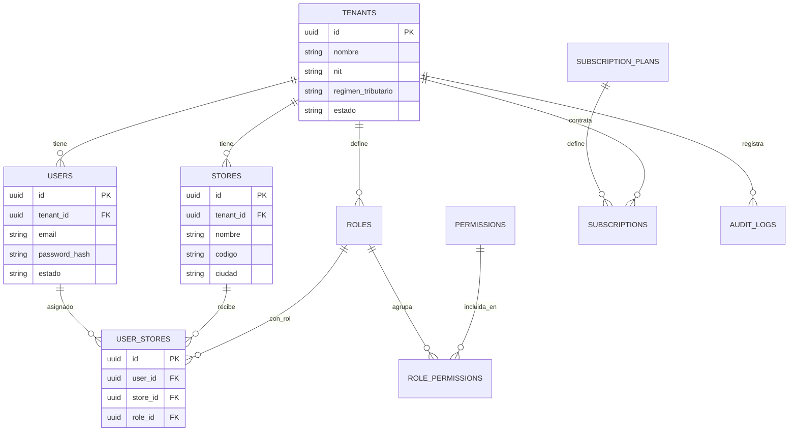
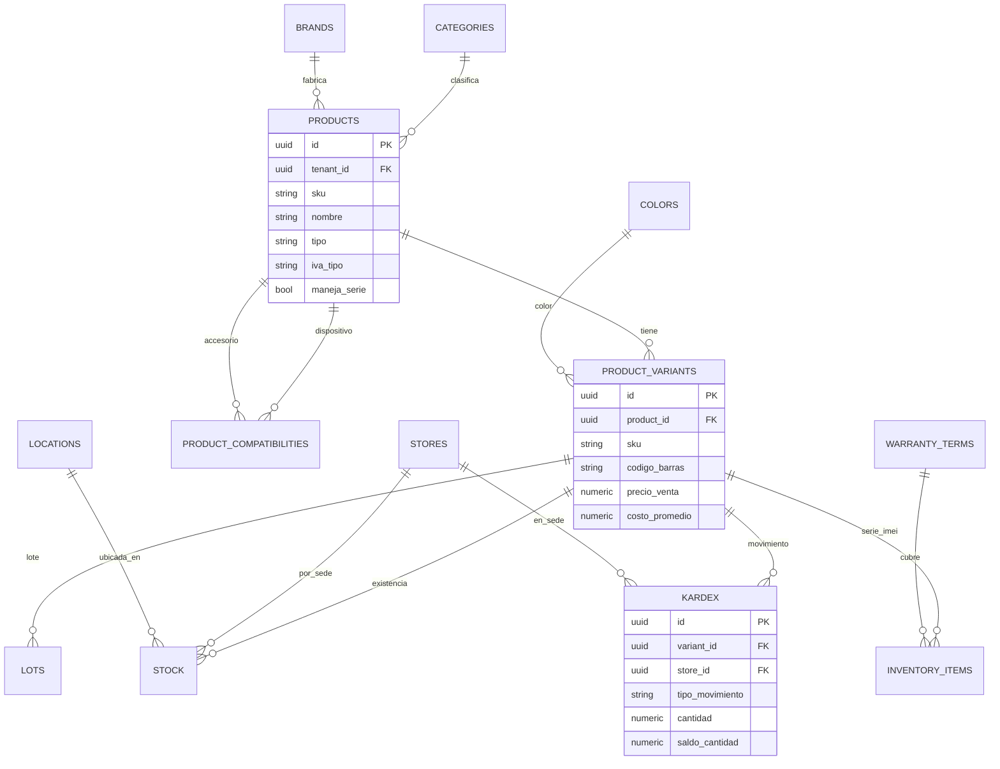
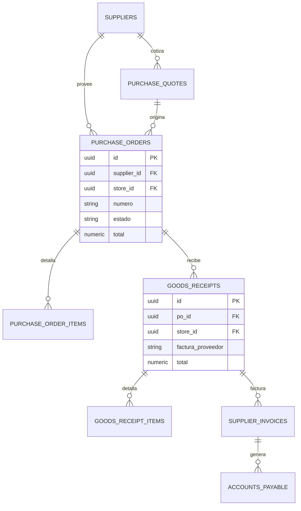
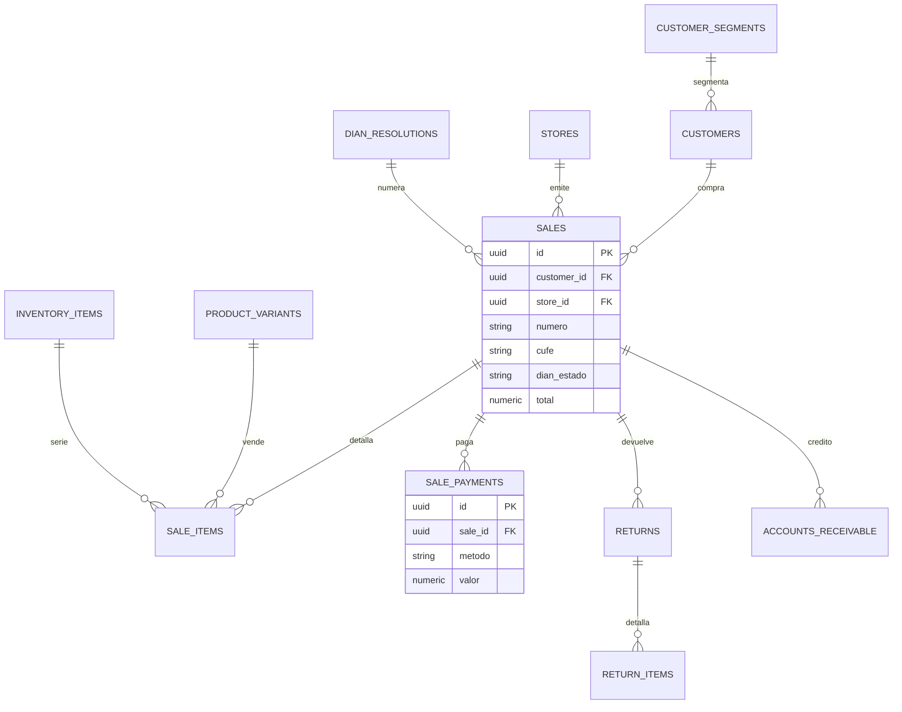
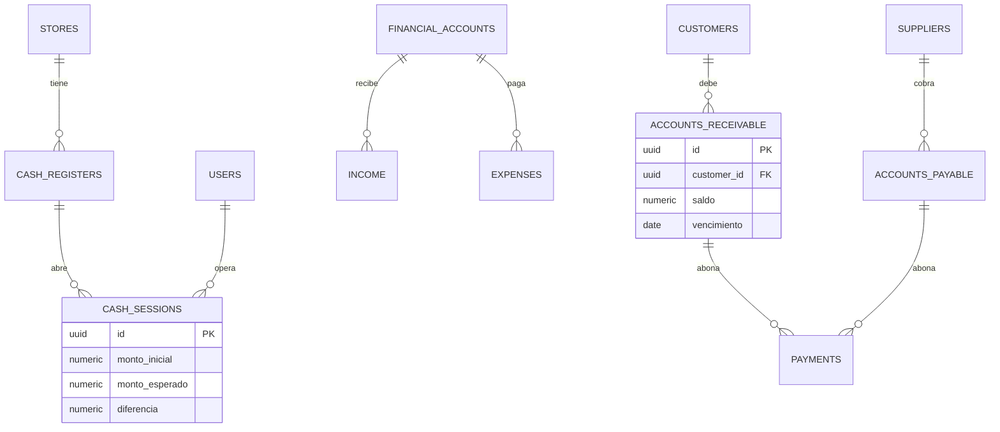

# ERP SaaS — Retail de Tecnología
## Fase 2: Modelo de Datos, Diagrama ER y Diccionario

> Base de datos **PostgreSQL** con aislamiento multi-tenant por **Row-Level Security**. Cubre multiempresa/multisede, inventario, compras, entradas, salidas, POS/ventas, facturación electrónica DIAN, finanzas, CRM, IA, alertas y auditoría.

---

## 1. Convenciones generales

- **Multi-tenant:** toda tabla de negocio incluye `tenant_id` (FK a `tenants`) con política RLS que filtra automáticamente por empresa.
- **Llaves primarias:** `UUID v7` (ordenable por tiempo); evita enumeración y facilita la sincronización offline de la app móvil.
- **Auditoría de filas:** `created_at`, `updated_at` (timestamptz) en todas las tablas; `deleted_at` (borrado lógico) en entidades clave.
- **Dinero:** `NUMERIC(14,2)` en COP. **Cantidades:** `NUMERIC(14,3)`. **Costos:** `NUMERIC(14,4)` (promedio ponderado).
- **IVA:** se guarda el tipo (`19`, `5`, `0`, `excluido`) y el valor calculado por línea.
- **Unidad vendible:** la **variante** (`product_variants`) es la que lleva stock, precio y costo. Un producto sin variaciones tiene una variante por defecto.
- **Trazabilidad de serie/IMEI:** los equipos de alto valor (celulares) se rastrean unidad por unidad en `inventory_items`.
- **Costeo:** **promedio ponderado** (estándar en retail colombiano); el `kardex` mantiene saldo de cantidad y de costo.

---

## 2. Diagramas ER por dominio

### A. Núcleo: multiempresa, multisede y seguridad

### B. Inventario

### C. Compras y entradas de mercancía

### D. Ventas, POS y facturación electrónica DIAN

### E. Control financiero

---

## 3. Diccionario de datos

### Núcleo y seguridad

**tenants** — empresas (clientes del SaaS)
| Campo | Tipo | Notas |
|---|---|---|
| id | uuid PK | |
| nombre, nit | string | NIT/RUT colombiano |
| regimen_tributario | string | responsable IVA / no responsable |
| estado | enum | activo, suspendido, prueba |

**stores** — sedes/sucursales
| Campo | Tipo | Notas |
|---|---|---|
| id | uuid PK | |
| tenant_id | uuid FK | |
| nombre, codigo, direccion, ciudad, telefono | string | |
| estado | enum | activa, inactiva |

**users / roles / permissions / role_permissions / user_stores** — usuarios y permisos
| Tabla | Campos clave | Notas |
|---|---|---|
| users | email, password_hash, telefono, twofa_secret, last_login, estado | autenticación + 2FA |
| roles | tenant_id, nombre, descripcion | Administrador, Gerente, Compras, Ventas, Bodega |
| permissions | codigo, descripcion | catálogo (ej. `inventory.edit`, `pos.sell`) |
| role_permissions | role_id, permission_id | M:N |
| user_stores | user_id, store_id, role_id | usuario ↔ sede ↔ rol (acceso multisede) |

**subscription_plans / subscriptions** — facturación SaaS (base; detalle en fase de monetización)
| Tabla | Campos clave |
|---|---|
| subscription_plans | nombre, precio_mensual, max_sedes, max_usuarios, features (JSONB) |
| subscriptions | tenant_id, plan_id, estado, fecha_inicio, fecha_fin |

### Inventario

**categories** — categorías (jerárquicas): `tenant_id, nombre, parent_id, estado`
**brands** — marcas: `tenant_id, nombre, estado`
**colors** — colores: `tenant_id, nombre, hex`

**products** — referencias (modelo/artículo)
| Campo | Tipo | Notas |
|---|---|---|
| id, tenant_id | uuid | |
| sku, codigo_barras, nombre, descripcion | string | |
| category_id, brand_id | uuid FK | |
| tipo | enum | dispositivo, accesorio, repuesto, servicio |
| unidad_medida | string | |
| iva_tipo | enum | 19, 5, 0, excluido |
| maneja_lote, maneja_serie, maneja_garantia | bool | |
| stock_min, stock_max | numeric | por defecto, sobreescribibles por sede |
| atributos | jsonb | specs (RAM, capacidad, pantalla...) |
| imagen_url, estado | | |

**product_variants** — unidad vendible (color/capacidad)
| Campo | Notas |
|---|---|
| product_id, sku, codigo_barras | código de barras/QR a nivel de variante |
| color_id, atributos (jsonb) | ej. capacidad 128GB |
| precio_venta, costo_promedio | costo recalculado en cada entrada |
| stock_min, stock_max | |

**product_compatibilities** — compatibilidades (motor de "accesorios compatibles")
| Campo | Notas |
|---|---|
| device_product_id | dispositivo |
| accessory_product_id | accesorio compatible |
| nota | M:N entre productos |

**locations** — ubicaciones (para mapa de bodega): `store_id, codigo, nombre, descripcion`
**lots** — lotes: `variant_id, numero_lote, fecha_ingreso, fecha_vencimiento, costo`

**inventory_items** — series/IMEI (trazabilidad unitaria)
| Campo | Notas |
|---|---|
| variant_id, store_id, lot_id | |
| imei, serial | únicos por tenant |
| estado | disponible, vendido, dañado, en_garantia, trasladado |
| garantia_fin | fecha |

**stock** — existencias por variante/sede/ubicación
| Campo | Notas |
|---|---|
| store_id, variant_id, location_id | |
| cantidad, stock_min, stock_max | índice único (store_id, variant_id, location_id) |

**kardex** — movimientos de inventario (libro automático, *append-only*)
| Campo | Notas |
|---|---|
| store_id, variant_id, fecha | |
| tipo_movimiento | entrada, salida, venta, devolución, ajuste, traslado |
| referencia_tipo, referencia_id | documento origen |
| cantidad | + o − |
| costo_unitario, saldo_cantidad, saldo_costo | promedio ponderado |
| usuario_id | |

**warranty_terms** — términos de garantía: `nombre, meses, descripcion`
**warranty_claims** — reclamaciones: `inventory_item_id, customer_id, fecha, descripcion_falla, estado, resolucion`

### Compras y entradas

| Tabla | Campos clave | Notas |
|---|---|---|
| suppliers | nit, nombre, contacto, telefono, email, terminos_pago | proveedores |
| purchase_quotes / _items | supplier_id, numero, fecha, estado, total / variant_id, cantidad, costo | cotizaciones |
| purchase_orders / _items | supplier_id, store_id, numero, estado, total / variant_id, cantidad, cantidad_recibida, costo | órdenes de compra |
| goods_receipts / _items | po_id, store_id, factura_proveedor, total / variant_id, lot_id, cantidad, costo, location_id | recepción → genera kardex(+), actualiza costo y crea series |
| supplier_invoices | supplier_id, receipt_id, numero, vencimiento, total, saldo, estado | origen de CxP |

### Ventas, POS y DIAN

**customers** — clientes (CRM)
| Campo | Notas |
|---|---|
| tipo_documento, numero_documento | CC/NIT |
| nombre, email, telefono, direccion, ciudad | |
| segment_id | segmentación |
| puntos_fidelidad | programa de fidelización |

**customer_segments** — segmentación: `nombre, criterio (jsonb), descripcion`

**dian_resolutions** — resoluciones DIAN (numeración autorizada)
| Campo | Notas |
|---|---|
| store_id, prefijo, resolucion_numero | |
| rango_desde, rango_hasta, consecutivo_actual | control de consecutivo |
| vigencia_desde, vigencia_hasta, tipo | factura electrónica / POS |

**sales** — ventas / facturas
| Campo | Notas |
|---|---|
| store_id, customer_id, vendedor_id | |
| prefijo, numero, resolution_id, fecha | |
| tipo | factura_electronica, pos, cotizacion |
| subtotal, descuento, iva, total | |
| cufe, dian_estado, xml_url, pdf_url | aceptada/rechazada/pendiente |

**sale_items** — detalle de venta
| Campo | Notas |
|---|---|
| variant_id, inventory_item_id | serie si aplica |
| cantidad, precio_unitario, descuento | |
| iva_tipo, iva_valor | |
| costo_unitario | snapshot para rentabilidad |
| garantia_meses, garantia_fin | |

**sale_payments** — medios de pago (múltiples por venta): `metodo (efectivo/tarjeta/transferencia/credito/QR), valor, referencia`
**returns / return_items** — devoluciones (nota crédito DIAN): `sale_id, motivo, total, cufe / sale_item_id, cantidad, valor`

### Salidas no-venta

| Tabla | Campos clave | Notas |
|---|---|---|
| inventory_adjustments / _items | tipo (ajuste/daño/pérdida), motivo / variant_id, cantidad, costo | salidas/entradas por ajuste |
| transfers / _items | store_origen_id, store_destino_id, estado / variant_id, cantidad | traslado = salida en origen + entrada en destino |

### Finanzas

| Tabla | Campos clave | Notas |
|---|---|---|
| cash_registers | store_id, nombre, estado | cajas POS |
| cash_sessions | cash_register_id, usuario_id, monto_inicial, monto_esperado, diferencia | arqueo/turno |
| financial_accounts | nombre, tipo (caja/banco), saldo | |
| income | fecha, concepto, categoria, valor, account_id, referencia | ingresos |
| expenses | fecha, concepto, categoria, valor, account_id, supplier_id | egresos |
| accounts_receivable | customer_id, sale_id, valor, saldo, vencimiento, estado | CxC |
| accounts_payable | supplier_id, supplier_invoice_id, valor, saldo, vencimiento, estado | CxP |
| payments | tipo (recibido/realizado), ar_id/ap_id, valor, fecha, metodo, account_id | abonos |

> **Flujo de caja** y **rentabilidad** se calculan en consultas/vistas a partir de `income`, `expenses`, `kardex` y `sale_items.costo_unitario`. No requieren tabla propia.

### IA, alertas y auditoría

| Tabla | Campos clave | Notas |
|---|---|---|
| alerts | tipo (stock_bajo/agotado/vencimiento/cxc_vencida/anomalía), entidad, mensaje, severidad, estado | alertas inteligentes |
| demand_forecasts | store_id, variant_id, periodo, cantidad_estimada, modelo, confianza | predicción de demanda |
| ai_queries | usuario_id, pregunta, respuesta, contexto (jsonb) | asistente en lenguaje natural |
| audit_logs | usuario_id, entidad, entidad_id, accion, datos_antes (jsonb), datos_despues (jsonb), ip | auditoría completa, *append-only* |

---

## 4. Reglas de negocio clave

- **Kardex automático:** toda entrada, salida, venta, devolución, ajuste o traslado inserta un registro en `kardex` con la cantidad firmada y recalcula `saldo_cantidad` y `saldo_costo`.
- **Costo promedio ponderado:** en cada recepción, `costo_promedio = (saldo_costo + costo_entrada) / (saldo_cantidad + cantidad_entrada)`.
- **Numeración DIAN:** cada venta toma el `consecutivo_actual` de su `dian_resolutions` dentro del rango vigente; al confirmarse se genera el CUFE y se encola el envío al Proveedor Tecnológico.
- **Traslado:** crea dos movimientos de kardex (− origen, + destino) y mantiene el estado en tránsito hasta la recepción en la sede destino.
- **Series/IMEI:** una venta con producto serializado descuenta el `inventory_item` específico y marca su estado como vendido; la garantía se calcula desde la fecha de venta.
- **Aislamiento:** ninguna consulta puede leer datos de otro `tenant_id`; lo garantiza la política RLS, no el código de aplicación.

---

## 5. Qué sigue

**Fase 3 — Diseño funcional:** módulos detallados, casos de uso, historias de usuario, flujos de usuario y la matriz completa de roles y permisos.
